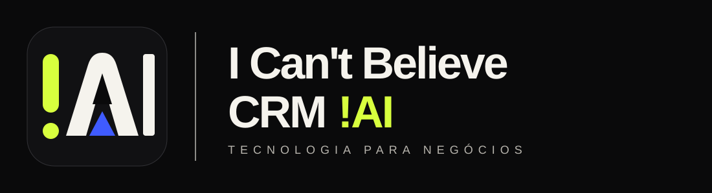

# I Can't Believe CRM

CRM self-hosted da **!AI (I Can't Believe It's AI)** para atendimento, vendas e automação com agentes de IA.




## O que é

I Can't Believe CRM é o CRM da !AI, preparado como produto próprio. Ele preserva a base funcional open source: CRM multi-tenant, WhatsApp como canal primário, agentes de IA, Supabase, LGPD, auditoria e instalação self-hosted.

## Tecnologias

- Next.js 16, React 19 e TypeScript
- Supabase Postgres, Auth, Storage e Realtime
- Tailwind CSS 4 e design system white-label
- WAHA para WhatsApp
- Vercel AI SDK e provedores de IA configuráveis
- Docker para instalação self-hosted

## Instalação local

```bash
git clone https://github.com/italopabloferreria/icantbelievecrm.git
cd icantbelievecrm
pnpm install
pnpm dev
```

## Docker

Use os arquivos `docker-compose*.yml` como base para ambientes locais e produção. Antes de publicar imagens, atualize os nomes no GitHub Container Registry para o repositório `italopabloferreria/icantbelievecrm`.

## Arquitetura

- `app/`: interface, rotas públicas, área autenticada e APIs Next.js
- `components/`: componentes compartilhados
- `lib/`: domínio, autenticação, branding, integrações e agentes
- `workers/`: workers e rotinas de fila
- `supabase/`: schema, migrations e baseline
- `docs/`: documentação técnica e operacional

## Identidade visual

O produto usa a paleta oficial da !AI: Carbon `#0A0A0B`, Bone `#F5F3ED`, Acid Lime `#D8FF3E` e Cobalt `#3F5BFF`. O guia e os arquivos vetoriais ficam em [`docs/brand`](docs/brand/README.md).

## Roadmap

- Publicar imagens Docker próprias
- Revisar documentação operacional de VPS para a marca !AI
- Adicionar funcionalidades específicas da !AI/Limpax sem quebrar a compatibilidade da base

## Screenshots

A referência visual oficial está em [`public/brand/ai-brand-board.jpg`](public/brand/ai-brand-board.jpg). Capturas do produto serão atualizadas conforme as telas forem validadas.

## Contribuição

Use branches pequenas, preserve regras de negócio existentes e rode validações de lint, tipos, testes e build antes de enviar mudanças.

## Based on the excepcional work from DeskcommCRM Created By Rafael Melgaço. Baseado no trabalho Sublime e Excepcional do DeskcommCRM Creado pelo Rafael Melgaço.

Este projeto é baseado no trabalho original de [DeskcommCRM](https://github.com/melgarafael/DeskcommCRM), distribuído sob licença MIT. O aviso de copyright e a licença original foram preservados em `LICENSE`.

## Licença

MIT.
